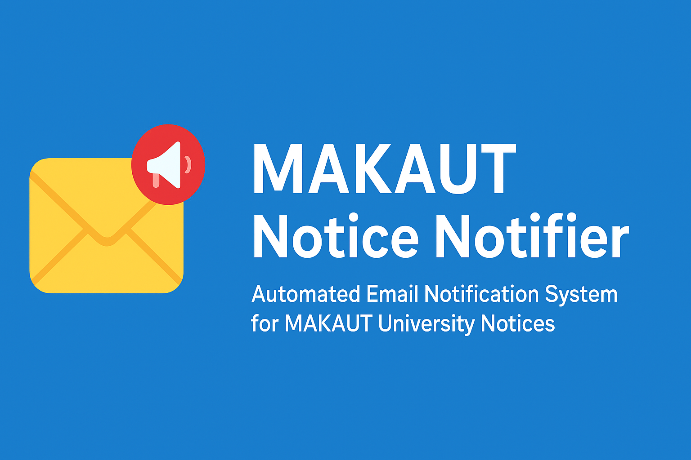
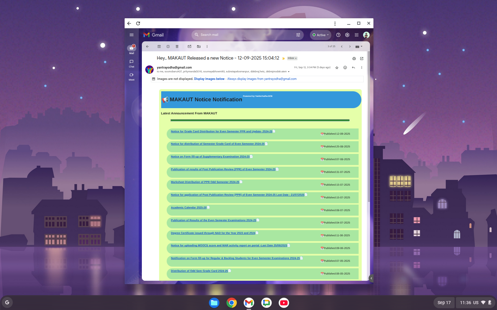

# 📢 MAKAUT Notice Notifier  

<p align="center">
  
</p>

<p align="center">
  <a href="LICENSE">
    
  </a>
  
  
  
</p>

---

## ✨ Features  

- 🔍 Fetches **latest notices** from MAKAUT API  
- 📧 Sends **HTML email notifications** with notice details  
- ⏱ Runs automatically every **15 minutes** (Google App Script Trigger)  
- 🛡 Tracks **last published notice** to avoid duplicates  
- 🎨 Beautiful **HTML Mail Template** with YantraYodha branding  

---

## 🖼 Sample Email Preview  

(Add your screenshot here 👇)  

  

---

## ⚙️ Deployment Steps  

Follow these steps to set up the notifier in your **Google Workspace / Gmail** account:  

1. **Open Google Apps Script**  
   - Go to [Google Apps Script](https://script.google.com/)  
   - Create a **new project**  

2. **Copy the Code**  
   - Paste all the `.gs` code from this repository into your project  

3. **Setup Recipients**  
   - In the `sendHiEmail` function, update the line:  
     ```js
     var recipient = "mail1@gmail.com,mail2@gmail.com";
     ```  
     with your desired email addresses  

4. **Deploy the Trigger**  
   - Run the `setupTrigger()` function once  
   - This will create a **time-based trigger** that checks for new notices every 15 minutes  

5. **Test It**  
   - Run the `getNotice()` function manually once  
   - You should receive an email if there’s a new notice 🎉  

---

## 📂 Project Structure  

````

📦 MAKAUT-Notice-Notifier
┣ 📜 Code.gs             # Main Google Apps Script code
┣ 📜 README.md           # Documentation (this file)
┣ 📜 LICENSE             # MIT License
┗ 🖼 sample-email.png     # Example email screenshot (to be added)

````

---

## 🧑‍💻 Author & Credits  

- 👨‍💻 **Project Developer**: [Pinaka](https://github.com/rax-2)  
- 🎓 **Powered by**: [YantraYodha ECE Club](https://yyaiem.github.io/yy/)  
- 📘 **Course Project**: [*Code Shiksha: Python Bhasha Mastery*](https://github.com/rax-2/Noob_to_Monstar_Python)  

---

## 📜 License  

This project is licensed under the **MIT License**.  

See the [LICENSE](LICENSE) file for details.  

---

## 🚀 Future Improvements  

- ✅ Add filtering by department / semester notices  
- ✅ Integrate with Telegram / Discord for instant alerts  
- ✅ Store notices in Google Sheets for notice history  

---

💡 *Happy Coding & Stay Updated with MAKAUT Notices!* 🎉  
----
